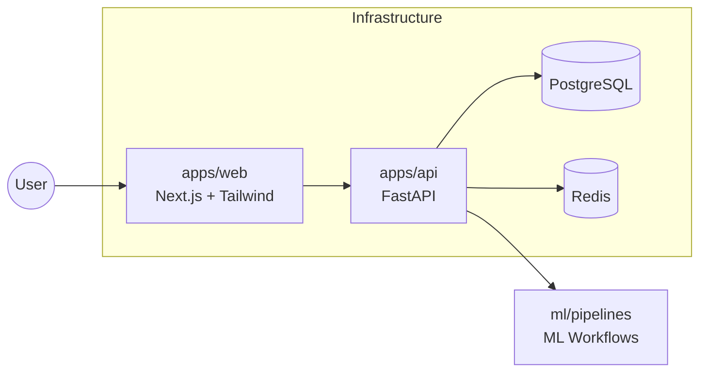

# Architecture Overview

The monorepo follows a modular architecture with clear boundaries between frontend, backend, ML, and infrastructure concerns.

## Components

- **apps/web**: UI foundation inspired by streaming-service layouts.
- **apps/api**: FastAPI service with health checks, typed response models, and structured logging.
- **ml**: Placeholders for training, feature, and inference pipelines.
- **infra**: Container orchestration via Docker Compose.
